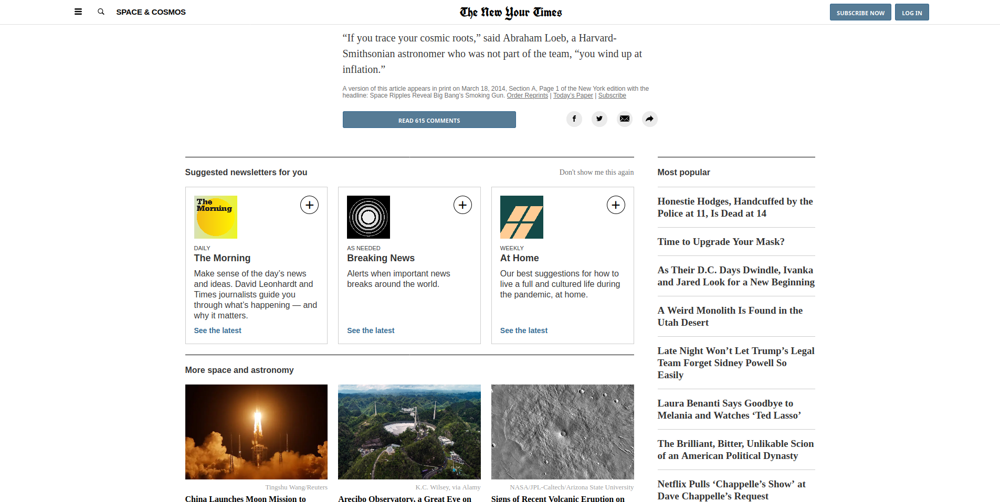

# Positioning

In this project for [The Odin Project](https://www.theodinproject.com) I cloned [this article](https://www.nytimes.com/2014/03/18/science/space/detection-of-waves-in-space-buttresses-landmark-theory-of-big-bang.html?_r=0) from the NY Times. The focus lay on techniques for positioning content on the page.

## Reflection

- I decided to use grid for the main layout and it proved very valuable (e.g. using grid gap, I spared myself a lot of playing around with margins). The original page uses grid only for the article suggestions at the bottom. I thought about using a wider grid with 12 columns, but I decided against it, because for this use case, it would provide sparsely any additional value.
- I styled the top-bar using flexbox. This works quite fine, and usually it would be best to just put `justify-content: space-between` or something like that on it and let it be. However, I decided to make the spacing as similar as possible to the original site and to achieve this, I had to work a lot with margins on the single objects. This works well enough in full screen mode, but the responsive behavior becomes kinda weird and not like the one of the original site. It seems they did it with nesting multiple elements. I reworked the top-bar then, using a wrapper for the flex-items. Giving this wrapper a max-width did the trick when it came to having a rather large margin on the sides fullscreen, but nearly no margin when resizing the window. Spacing is not exactly like in the original site, but close enough and the responsive behavior is far, far better.

## Demo

[View it here](https://reinimax.github.io/positioning/)
